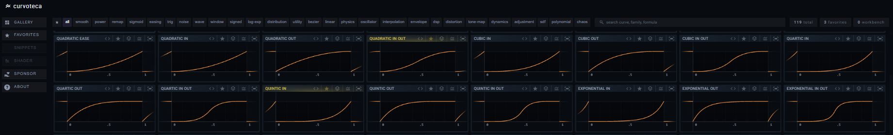

# Curvoteca

Visual curve reference, workbench, and snippet library.

## About

A visual reference for the curve-curious. Tuning animation timing? Crafting shader falloff? Building UI transitions? Curvoteca lets you browse, inspect, collect, and copy equations without leaving the gallery.

A free, gallery-first curve reference for artists and developers in constant development. Browse mathematical curves, inspect them in detail, collect them in a workbench, and copy production-ready snippets for VEX, HLSL, GLSL, JavaScript, TypeScript, C#, Rust, Python, and more.

Curvoteca is built for animation timing, shader falloffs, procedural masks, UI transitions, SDFs, waves, noise shaping, tone mapping, and other curve-driven, graph, math, shader, algorithm making workflows.

No accounts necessary. Just a lightweight visual reference made by someone who needed it, shared with anyone who does too. The intention is to keep scaling it — more curves, richer previews, more formats, and always free.

## Support

Curvoteca is a free, static reference — no accounts. If the curves save you time or spark an idea, a small donation helps keep the project growing.

If you desire to support Curvoteca more directly, sponsor inquiries are welcome — especially from tools, courses, creators, and projects useful to technical artists, shader developers, procedural artists, and creative coders.

**What donations fund:**
- Domain, hosting, and CDN costs
- Adding more curves, formats, and features
- Expanding the equation library across more languages and tools
- Helping keep everything free and open for everyone and avoiding accounts or subscriptions

Donate → [curvoteca.com/#support](https://curvoteca.com/#support)

Planned/Shipped languages: JS, GLSL, VEX, Python, C#, Rust, C, C++, HLSL, OpenCL, Lua, Metal, WGSL, CUDA, Swift, Kotlin, TypeScript, TouchDesigner, Java, MATLAB, Dart, Julia, MEL, GDScript, Blueprint, After Effects, DCTL, CSS, Framer Motion, GSAP, Arduino, OSL, Max/MSP gen~, REAPER JSFX, Nuke, Csound, ChucK, JSON, SVG, Haskell, Fortran, R, Wolfram Language, and more.
